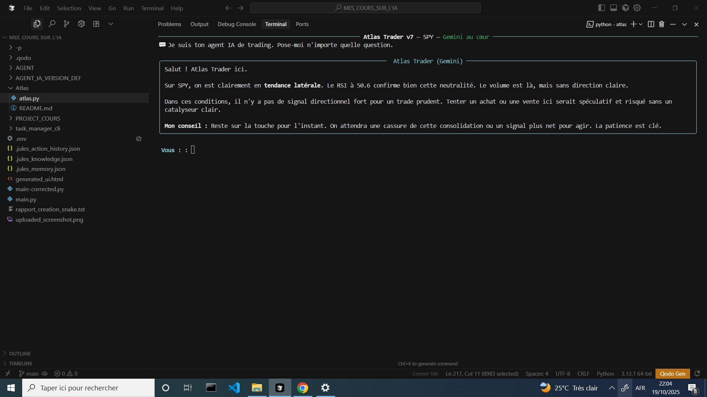

# 📈 Atlas Trader v1 – Agent IA de Trading


**Un agent IA conversationnel avec Google Gemini au cœur**  
**Analyse, stratégie et recommandations pour t’aider à trader intelligemment** 🚀

---

<p align="center">
  
</p>

---

## 💡 Pourquoi Atlas Trader est unique

| 🎯 Fonctionnalité | 🔍 Description | 🌟 Avantage clé |
|------------------|----------------|----------------|
| **Analyse marché** 📊 | 6 mois de données Yahoo Finance, SMA50/SMA200/RSI calculés | Indicateurs prêts pour Gemini |
| **IA conversationnelle** 🤖 | Pose tes questions directement dans le terminal | Réponses claires, actionnables et rapides |
| **Gestion du risque** ⚠️ | Taille du trade relative au capital | Pas de levier excessif |
| **Logging automatique** 📝 | Historique dans `atlas_trader_log.json` | Analyse post-trade simple |
| **Boucle interactive** 🔄 | Plusieurs questions sur plusieurs symboles | Conversation fluide, comme avec un vrai trader |
| **Gemini au cœur** 🧠 | Google Gemini 2.5 Flash | Analyse marché, stratégie et explication détaillée |

---

## 📊 Indicateurs clés

| 🔹 Indicateur | 💡 Explication | 📊 Exemple |
|---------------|----------------|------------|
| **SMA50 / SMA200** | Moyenne mobile courte / longue | Détecte tendance haussière/baissière |
| **RSI** | Relative Strength Index | Surachat (>70) / Survente (<30) |
| **Volume** | Nombre de titres échangés | Indique force du mouvement |

---

## ⚙️ Installation rapide

| 🔢 Étape | 📝 Commande / Description |
|----------|--------------------------|
| 1️⃣ Clone le dépôt | `git clone https://github.com/Reacknadam/Atlas.git` |
| 2️⃣ Installe les dépendances | `pip install -r requirements.txt` |
| 3️⃣ Configure la clé Gemini | `export GEMINI_API_KEY="ta_cle_api"` |
| 4️⃣ Lance Atlas Trader | `python atlas_trader.py --symbol SPY` |

> Remplace `SPY` par n’importe quel symbole pour analyser ce marché.

---

## 🏷️ Exemple d’utilisation

```bash
$ python atlas_trader.py --symbol AAPL
💬 Je suis ton agent IA de trading. Pose-moi n'importe quelle question.
````

**Exemples de questions :**

* « Quelle est la tendance du marché pour AAPL ? »
* « Recommande un trade sur SPY avec 1% du capital »
* « Explique-moi le RSI et les SMA »

---

## 📁 Structure du projet

```
atlas-trader/
├── atlas_trader.py      # Code principal
├── requirements.txt
├── .env                 # Clé GEMINI_API_KEY
├── README.md            # Ce fichier
└── atlas_trader_log.json # Historique des interactions
```

---

## 🌟 Roadmap & fonctionnalités à venir

| 🚀 Fonctionnalité                                 | 📅 Statut  |
| ------------------------------------------------- | ---------- |
| Multi-symboles & portefeuilles                    | ⏳ En cours |
| Autres sources de données                         | ⏳ En cours |
| Version Web (Gradio)                              | ⏳ En cours |
| Suggestions de trades automatiques via API broker | ⏳ En cours |

---

## 💛 Soutenir Atlas Trader

Tu peux **m’aider à améliorer mes projets IA** via un soutien simple et rapide :

| Moyen                               | Détail                                                                                      |
| ----------------------------------- | ------------------------------------------------------------------------------------------- |
| 📱 **MPESA**                        | +243 811 729 589                                                                            |
| 💳 **Chariow paiement automatique** | 👉 [https://brwqjjmk.mychariow.shop/israel-ltd](https://brwqjjmk.mychariow.shop/israel-ltd) |

> Chaque contribution aide à :
>
> * Maintenir le serveur Gemini
> * Développer de nouvelles IA
> * Ajouter des fonctionnalités pro
>   Merci pour ton soutien 🙏

---

## 🛡️ Licence

**MIT License** — libre d’utilisation, même commercial.

---

## ⭐ Star & Watch

**⭐ Star** le repo si Atlas Trader t’a déjà fait gagner du temps ou mieux comprendre le marché.
**🔔 Watch** le projet pour suivre les mises à jour et nouvelles fonctionnalités.
